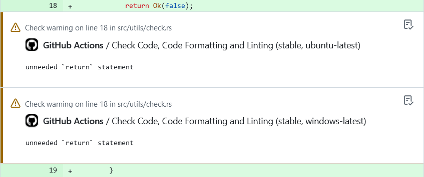

# Rust Problem Matchers

GitHub Action to set up [Problem Matchers](https://github.com/actions/toolkit/blob/main/docs/problem-matchers.md) for Rust.

<picture>
  <source media="(prefers-color-scheme: light)" srcset=".github/assets/demo.png" />
  <source media="(prefers-color-scheme: dark)" srcset=".github/assets/demo-dark.png" />
  
</picture>

## Usage

Add this action to the `uses` field of a new step before executing any `cargo` action.

```yaml
- name: Set up Rust Problem Matchers
  uses: catuhana/rust-problem-matchers@v2
```

<details>
  <summary>Full Example</summary>

  ```yaml
  name: CI

  on:
    - push
    - pull_request

  jobs:
    ci:
      name: Check Code, Code Formatting and Linting
      runs-on: ubuntu-latest
      steps:
        - name: Checkout repository
          uses: actions/checkout@v4

        - name: Set up Rust problem matchers
          uses: catuhana/rust-problem-matchers@v2

        - name: Set up or update Rust stable toolchain
          run: rustup toolchain install stable --profile default

        - name: Set up Rust cache
          uses: actions/cache@v4
          with:
            path: |
              ~/.cargo/bin
              ~/.cargo/registry/index
              ~/.cargo/registry/cache
              ~/.cargo/git/db
              target/
            key: ${{ runner.os }}-cargo-stable-${{ hashFiles('**/Cargo.lock') }}

        - name: Check Rust code
          continue-on-error: true
          run: cargo +stable check --verbose --all

        - name: Check Rust code format
          continue-on-error: true
          run: cargo +stable fmt --verbose --all --check

        - name: Check Rust code lint
          continue-on-error: true
          run: cargo +stable clippy --verbose -- -W clippy::nursery
  ```
</details>

## What Are the Differences From the Upstream? Why Not Upstreaming This Fork?

I forked the project to bring back the `composite` step that upstream removed to avoid `bash` dependency on Windows runners. I never had issues with it on GitHub-hosted runners, and figured others might prefer this to avoid the `node` deprecation warning.
