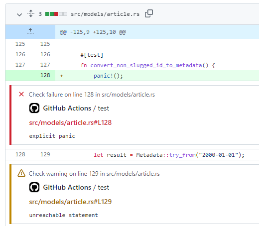

# Rust Problem Matchers

GitHub Action to set-up [Problem Matchers](https://github.com/actions/toolkit/blob/main/docs/problem-matchers.md) for Rust.



## Usage

Add the this action repository to `uses` key of any step:

```yaml
- name: Set-up Rust Problem Matchers
  uses: catuhana/rust-problem-matchers@v1
```
